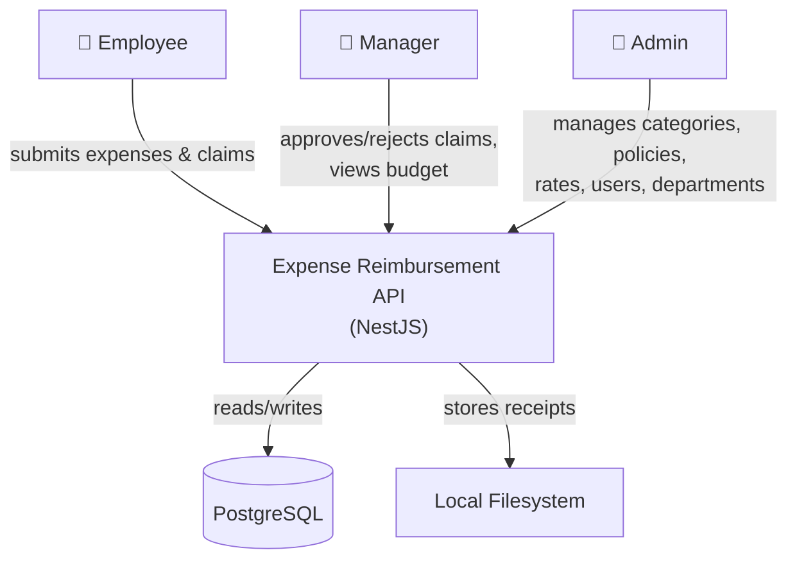
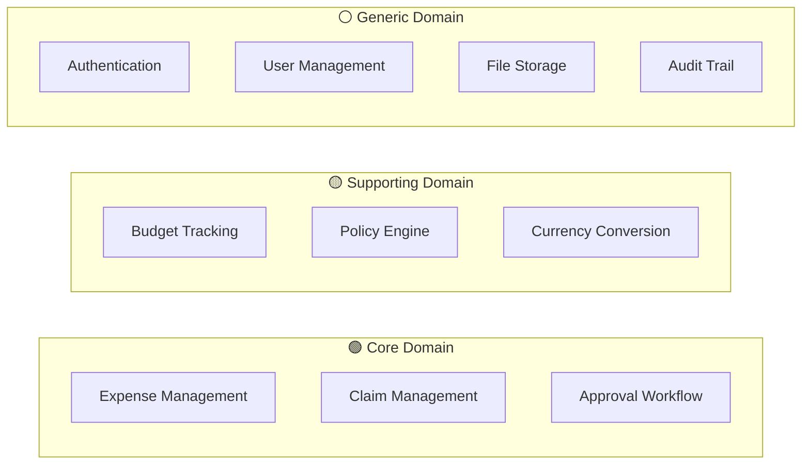
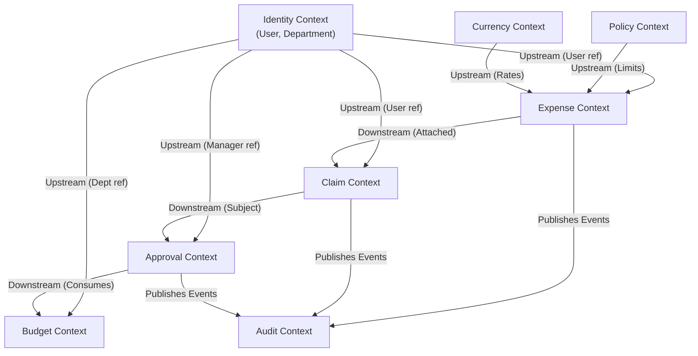
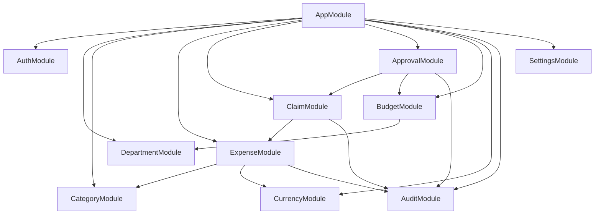
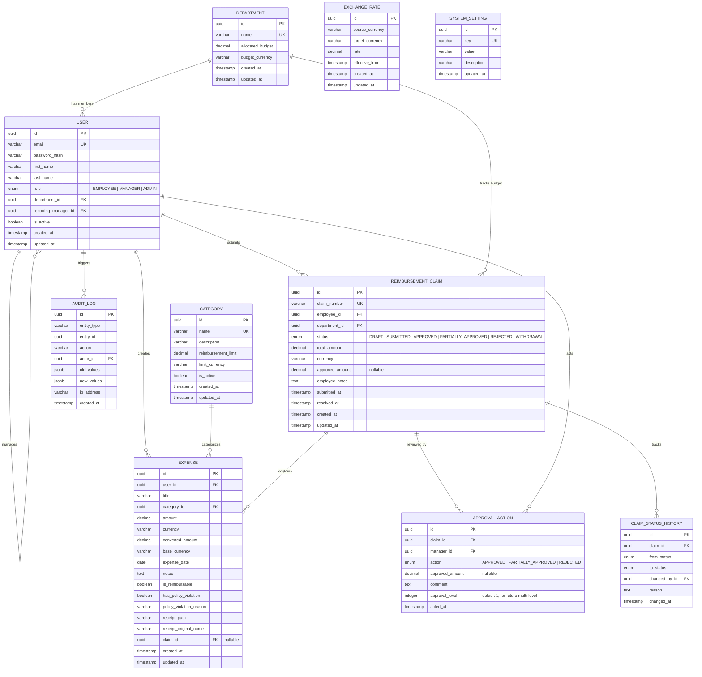
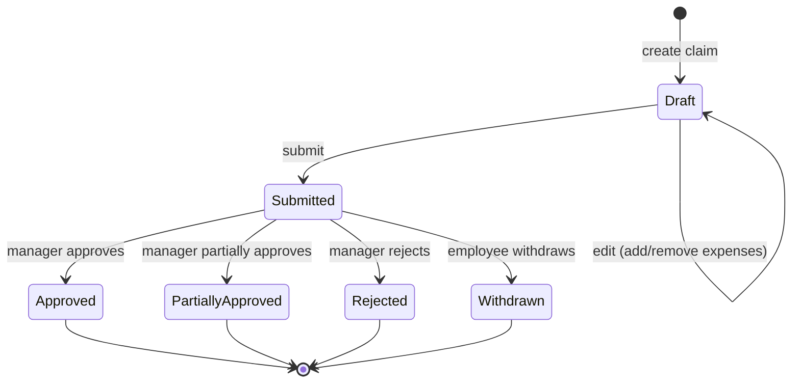
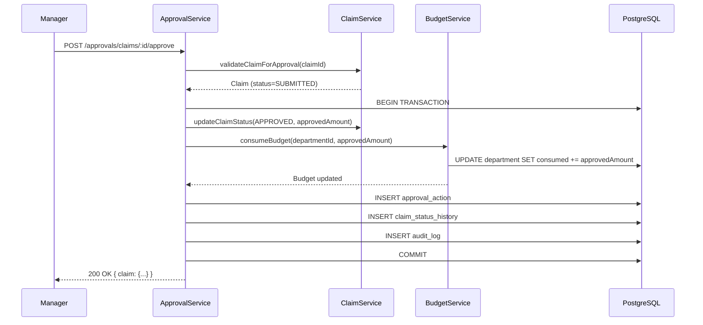

# Expense Reimbursement Management System — Architecture Plan

> **Version:** 1.0 (MVP)
> **Date:** 2026-06-02
> **Stack:** NestJS · PostgreSQL · TypeORM
> **Architecture:** Modular Monolith · Clean Architecture · Domain-Driven Design (Partial)

---

## Table of Contents

1. [System Overview](#1-system-overview)
2. [MVP Feature List](#2-mvp-feature-list)
3. [Domain-Driven Design](#3-domain-driven-design)
4. [Architecture Layers](#4-architecture-layers)
5. [Module Structure](#5-module-structure)
6. [Database Schema](#6-database-schema)
7. [API Contract](#7-api-contract)
8. [Approval Workflow Design](#8-approval-workflow-design)
9. [Cross-Cutting Concerns](#9-cross-cutting-concerns)
10. [Decision Log](#10-decision-log)
11. [Future Extensibility](#11-future-extensibility)

---

## 1. System Overview

### Problem Statement

Organizations need a structured, auditable system to manage employee expense submissions, enforce category-based reimbursement policies, route claims through approval workflows, and track department budgets against approved reimbursements.

### System Context (C4 — Level 1)



### Actors & Responsibilities

| Actor | Responsibilities |
|-------|-----------------|
| **Employee** | Create expenses, upload receipts, create/submit/withdraw reimbursement claims |
| **Manager** | Approve/partially approve/reject claims, view department budget |
| **Admin** | Manage users, departments, categories, policy limits, exchange rates, system settings |

---

## 2. MVP Feature List

### P0 — Must Have (MVP)

| # | Feature | Module | Actor |
|---|---------|--------|-------|
| 1 | JWT authentication (login, token refresh) | Auth | All |
| 2 | Department CRUD with budget allocation | Department | Admin |
| 3 | Category CRUD with reimbursement limits | Category | Admin |
| 4 | Exchange rate CRUD (static, Admin-managed) | Currency | Admin |
| 5 | System settings (base currency) | Settings | Admin |
| 6 | Create/edit/delete expense | Expense | Employee |
| 7 | Upload receipt (single file per expense) | Expense | Employee |
| 8 | Mark expense as reimbursable/non-reimbursable | Expense | Employee |
| 9 | Validate expense against category limit (flag, don't block) | Expense | System |
| 10 | Create reimbursement claim (draft) | Claim | Employee |
| 11 | Attach multiple reimbursable expenses to claim | Claim | Employee |
| 12 | Submit claim | Claim | Employee |
| 13 | Withdraw claim (before manager review) | Claim | Employee |
| 14 | Approve / Partially Approve / Reject claim | Approval | Manager |
| 15 | Mandatory comments on rejection & partial approval | Approval | Manager |
| 16 | Budget consumption on approval | Budget | System |
| 17 | Claim status tracking (Draft → Submitted → Approved/Rejected/Withdrawn) | Claim | Employee |
| 18 | Claim status history log | Audit | System |
| 19 | Approval audit log | Audit | System |
| 20 | Multi-currency expense with base currency equivalent | Currency | System |
| 21 | Paginated list endpoints for all entities | All | All |

### P1 — Designed For, Not Implemented

| # | Feature | Notes |
|---|---------|-------|
| 1 | Role-based access control (RBAC) | Guards + decorators designed, enforce per-role access |
| 2 | User CRUD (Admin creates users, assigns roles, departments, managers) | Admin user management module |
| 3 | Budget dashboard (allocated / consumed / remaining) | Manager-facing budget visibility |
| 4 | Multi-level approval workflow | Workflow engine designed extensibly |
| 5 | Finance actor & payment processing | New role + claim terminal state |
| 6 | Notifications (email, in-app, Slack) | Event-driven hooks ready |
| 7 | Cloud file storage (S3/GCS) | StorageProvider interface |
| 8 | Reporting & analytics | Read-optimized queries |
| 9 | Bulk import/export | Batch processing endpoints |

---

## 3. Domain-Driven Design

### 3.1 DDD Viability Check

| Criterion | Applicable? |
|-----------|-------------|
| Complex/fast-changing business rules | ✅ Policy validation, approval workflows |
| Auditability and explicit invariants | ✅ Full audit trail required |
| Multiple integration contracts | ⚠️ MVP is self-contained, but future extensibility needed |

**Decision:** Partial DDD — rich domain entities, clear bounded contexts, value objects for Money/Currency. No event sourcing or CQRS for MVP.

### 3.2 Subdomain Map



### 3.3 Bounded Contexts

| Context | Aggregates | Key Invariants |
|---------|-----------|----------------|
| **Expense** | `Expense` | Amount > 0; category must exist; receipt optional but single file; currency must be valid |
| **Claim** | `ReimbursementClaim` | Only reimbursable expenses can be attached; all expenses must belong to claim owner; claim can only be submitted from Draft; withdrawal only from Submitted |
| **Approval** | `ApprovalAction` | Only assigned manager can act; comment required for Reject/PartialApprove; cannot act on non-Submitted claims |
| **Budget** | `DepartmentBudget` | Consumed ≤ Allocated; only approved amounts consume budget |
| **Policy** | `CategoryPolicy` | Limit ≥ 0; category-limit pair unique |
| **Identity** | `User`, `Department` | Email unique; user belongs to exactly one department; user has one reporting manager |
| **Currency** | `ExchangeRate` | Source-target pair unique; rate > 0 |

### 3.4 Ubiquitous Language Glossary

| Term | Definition |
|------|-----------|
| **Expense** | A single financial outlay by an employee with a date, amount, category, and optional receipt |
| **Reimbursable** | Flag on expense indicating it is eligible for reimbursement |
| **Reimbursement Claim** | A bundle of reimbursable expenses submitted by an employee for approval |
| **Policy Violation** | When an expense amount exceeds the configured category limit — flagged but not blocked |
| **Partial Approval** | Manager approves a claim with a reduced reimbursement amount |
| **Base Currency** | The single company-wide reporting currency (e.g., USD) |
| **Converted Amount** | The base-currency equivalent of an expense, computed using the static exchange rate |
| **Budget Allocation** | The total amount a department is authorized to reimburse |
| **Budget Consumed** | The sum of approved reimbursement amounts for a department |

### 3.5 Context Map



---

## 4. Architecture Layers

### Clean Architecture — Layer Dependency Rule

```
┌──────────────────────────────────────────────────┐
│                  Presentation                     │
│         Controllers · Guards · Pipes              │
│              DTOs (Request/Response)              │
├──────────────────────────────────────────────────┤
│                  Application                      │
│          Services · Use Cases · Mappers           │
│          Interfaces (Ports) · Commands            │
├──────────────────────────────────────────────────┤
│                    Domain                         │
│       Entities · Value Objects · Enums            │
│      Domain Services · Repository Ports           │
├──────────────────────────────────────────────────┤
│                Infrastructure                     │
│     TypeORM Entities · Repository Impls           │
│   Storage Provider · Guards · Config              │
└──────────────────────────────────────────────────┘

         Dependencies flow INWARD only ↑
```

### Layer Rules

| Layer | Can Depend On | Cannot Depend On |
|-------|--------------|-------------------|
| **Domain** | Nothing (pure) | Application, Infrastructure, Presentation |
| **Application** | Domain | Infrastructure, Presentation |
| **Infrastructure** | Domain, Application | Presentation |
| **Presentation** | Application | Domain (directly), Infrastructure |

---

## 5. Module Structure

### 5.1 NestJS Module Topology

```
src/
├── main.ts
├── app.module.ts
│
├── common/                              # Shared kernel
│   ├── decorators/
│   │   └── current-user.decorator.ts
│   ├── guards/
│   │   └── jwt-auth.guard.ts
│   ├── interceptors/
│   │   └── audit.interceptor.ts
│   ├── pipes/
│   │   └── validation.pipe.ts
│   ├── filters/
│   │   └── http-exception.filter.ts
│   ├── dto/
│   │   └── pagination-query.dto.ts
│   ├── entities/
│   │   └── base.entity.ts               # id, createdAt, updatedAt
│   ├── enums/
│   │   └── claim-status.enum.ts
│   └── interfaces/
│       └── paginated-result.interface.ts
│
├── modules/
│   ├── auth/
│   │   ├── auth.module.ts
│   │   ├── auth.controller.ts
│   │   ├── auth.service.ts
│   │   ├── strategies/
│   │   │   └── jwt.strategy.ts
│   │   └── dto/
│   │       ├── login.dto.ts
│   │       └── auth-response.dto.ts
│   │
│   ├── department/
│   │   ├── department.module.ts
│   │   ├── department.controller.ts
│   │   ├── department.service.ts
│   │   ├── entities/
│   │   │   └── department.entity.ts
│   │   └── dto/
│   │       ├── create-department.dto.ts
│   │       └── update-department.dto.ts
│   │
│   ├── category/
│   │   ├── category.module.ts
│   │   ├── category.controller.ts
│   │   ├── category.service.ts
│   │   ├── entities/
│   │   │   └── category.entity.ts
│   │   └── dto/
│   │       ├── create-category.dto.ts
│   │       └── update-category.dto.ts
│   │
│   ├── expense/
│   │   ├── expense.module.ts
│   │   ├── expense.controller.ts
│   │   ├── expense.service.ts
│   │   ├── policy-validator.service.ts
│   │   ├── local-storage.service.ts      # Direct local filesystem
│   │   ├── entities/
│   │   │   └── expense.entity.ts
│   │   ├── dto/
│   │   │   ├── create-expense.dto.ts
│   │   │   ├── update-expense.dto.ts
│   │   │   └── expense-response.dto.ts
│   │   └── value-objects/
│   │       └── money.vo.ts
│   │
│   ├── claim/
│   │   ├── claim.module.ts
│   │   ├── claim.controller.ts
│   │   ├── claim.service.ts
│   │   ├── claim-state-machine.service.ts
│   │   ├── entities/
│   │   │   └── reimbursement-claim.entity.ts
│   │   └── dto/
│   │       ├── create-claim.dto.ts
│   │       ├── update-claim.dto.ts
│   │       └── claim-response.dto.ts
│   │
│   ├── approval/
│   │   ├── approval.module.ts
│   │   ├── approval.controller.ts
│   │   ├── approval.service.ts
│   │   ├── entities/
│   │   │   └── approval-action.entity.ts
│   │   └── dto/
│   │       ├── approve-claim.dto.ts
│   │       ├── partial-approve-claim.dto.ts
│   │       └── reject-claim.dto.ts
│   │
│   ├── budget/
│   │   ├── budget.module.ts
│   │   ├── budget.service.ts             # Internal service, no controller for MVP
│   │   └── entities/
│   │       └── (uses department.entity)
│   │
│   ├── currency/
│   │   ├── currency.module.ts
│   │   ├── currency.controller.ts
│   │   ├── currency.service.ts
│   │   ├── entities/
│   │   │   └── exchange-rate.entity.ts
│   │   └── dto/
│   │       ├── create-exchange-rate.dto.ts
│   │       └── exchange-rate-response.dto.ts
│   │
│   ├── audit/
│   │   ├── audit.module.ts
│   │   ├── audit.controller.ts
│   │   ├── audit.service.ts
│   │   └── entities/
│   │       ├── audit-log.entity.ts
│   │       └── claim-status-history.entity.ts
│   │
│   └── settings/
│       ├── settings.module.ts
│       ├── settings.controller.ts
│       ├── settings.service.ts
│       └── entities/
│           └── system-setting.entity.ts
│
├── database/
│   ├── migrations/
│   ├── seeds/
│   └── data-source.ts
│
└── config/
    ├── app.config.ts
    ├── database.config.ts
    ├── jwt.config.ts
    └── storage.config.ts
```

> **Note:** User module (with RBAC guards) is a P1 feature. For MVP, user entity exists as a DB table referenced by other modules, but no dedicated UserModule/Controller is exposed.

### 5.2 Module Dependency Graph



---

## 6. Database Schema

### 6.1 Entity-Relationship Diagram



### 6.2 Key Indexes

```sql
-- Performance-critical indexes
CREATE INDEX idx_expense_user_id ON expense(user_id);
CREATE INDEX idx_expense_claim_id ON expense(claim_id);
CREATE INDEX idx_expense_category_id ON expense(category_id);
CREATE INDEX idx_expense_is_reimbursable ON expense(is_reimbursable) WHERE claim_id IS NULL;

CREATE INDEX idx_claim_employee_id ON reimbursement_claim(employee_id);
CREATE INDEX idx_claim_department_id ON reimbursement_claim(department_id);
CREATE INDEX idx_claim_status ON reimbursement_claim(status);
CREATE UNIQUE INDEX idx_claim_number ON reimbursement_claim(claim_number);

CREATE INDEX idx_approval_claim_id ON approval_action(claim_id);
CREATE INDEX idx_approval_manager_id ON approval_action(manager_id);

CREATE INDEX idx_status_history_claim_id ON claim_status_history(claim_id);
CREATE INDEX idx_audit_entity ON audit_log(entity_type, entity_id);
CREATE INDEX idx_audit_actor ON audit_log(actor_id);
CREATE INDEX idx_audit_created_at ON audit_log(created_at);

CREATE UNIQUE INDEX idx_exchange_rate_pair ON exchange_rate(source_currency, target_currency);
```

### 6.3 Value Object: Money

```typescript
// domain/value-objects/money.vo.ts
export class Money {
  constructor(
    public readonly amount: number,
    public readonly currency: string,
  ) {
    if (amount < 0) throw new Error('Amount cannot be negative');
    if (!currency || currency.length !== 3) throw new Error('Invalid ISO 4217 currency code');
  }

  toBase(rate: number): Money {
    return new Money(
      Math.round(this.amount * rate * 100) / 100,
      // base currency injected by caller
      'BASE',
    );
  }

  equals(other: Money): boolean {
    return this.amount === other.amount && this.currency === other.currency;
  }
}
```

---

## 7. API Contract

### 7.1 Standard Response Envelope

```typescript
// Success
{
  "success": true,
  "data": { ... },
  "meta": {                    // for paginated responses
    "page": 1,
    "limit": 20,
    "total": 150,
    "totalPages": 8
  }
}

// Error
{
  "success": false,
  "error": {
    "code": "CLAIM_NOT_IN_SUBMITTED_STATE",
    "message": "Claim must be in SUBMITTED status to approve",
    "details": []
  }
}
```

### 7.2 Endpoint Summary

#### Auth

| Method | Endpoint | Description | Actor |
|--------|----------|-------------|-------|
| POST | `/api/v1/auth/login` | Authenticate, return JWT | All |
| POST | `/api/v1/auth/refresh` | Refresh access token | All |
| GET | `/api/v1/auth/me` | Get current user profile | All |

#### Departments (Admin)

| Method | Endpoint | Description |
|--------|----------|-------------|
| POST | `/api/v1/departments` | Create department |
| GET | `/api/v1/departments` | List departments |
| GET | `/api/v1/departments/:id` | Get department |
| PATCH | `/api/v1/departments/:id` | Update department |
| PATCH | `/api/v1/departments/:id/budget` | Update budget allocation |

#### Categories (Admin)

| Method | Endpoint | Description |
|--------|----------|-------------|
| POST | `/api/v1/categories` | Create category with limit |
| GET | `/api/v1/categories` | List categories |
| PATCH | `/api/v1/categories/:id` | Update category / limit |

#### Exchange Rates (Admin)

| Method | Endpoint | Description |
|--------|----------|-------------|
| POST | `/api/v1/exchange-rates` | Create/update exchange rate |
| GET | `/api/v1/exchange-rates` | List all rates |
| DELETE | `/api/v1/exchange-rates/:id` | Remove rate |

#### System Settings (Admin)

| Method | Endpoint | Description |
|--------|----------|-------------|
| GET | `/api/v1/settings` | Get all settings |
| PATCH | `/api/v1/settings/:key` | Update setting |

#### Expenses (Employee)

| Method | Endpoint | Description |
|--------|----------|-------------|
| POST | `/api/v1/expenses` | Create expense |
| GET | `/api/v1/expenses` | List my expenses (paginated, filterable) |
| GET | `/api/v1/expenses/:id` | Get expense detail |
| PATCH | `/api/v1/expenses/:id` | Update expense (if not attached to submitted claim) |
| DELETE | `/api/v1/expenses/:id` | Delete expense (if not attached to submitted claim) |
| POST | `/api/v1/expenses/:id/receipt` | Upload receipt (multipart) |
| GET | `/api/v1/expenses/:id/receipt` | Download receipt |
| DELETE | `/api/v1/expenses/:id/receipt` | Remove receipt |

#### Reimbursement Claims (Employee)

| Method | Endpoint | Description |
|--------|----------|-------------|
| POST | `/api/v1/claims` | Create draft claim |
| GET | `/api/v1/claims` | List my claims (paginated, filterable by status) |
| GET | `/api/v1/claims/:id` | Get claim detail (with expenses, history) |
| PATCH | `/api/v1/claims/:id` | Update draft claim (add/remove expenses, notes) |
| POST | `/api/v1/claims/:id/submit` | Submit claim for approval |
| POST | `/api/v1/claims/:id/withdraw` | Withdraw submitted claim |

#### Approvals (Manager)

| Method | Endpoint | Description |
|--------|----------|-------------|
| GET | `/api/v1/approvals/pending` | List claims pending my approval |
| GET | `/api/v1/approvals/history` | List my past approval actions |
| GET | `/api/v1/approvals/claims/:id` | View claim detail for review |
| POST | `/api/v1/approvals/claims/:id/approve` | Approve claim |
| POST | `/api/v1/approvals/claims/:id/partial-approve` | Partially approve (with amount + comment) |
| POST | `/api/v1/approvals/claims/:id/reject` | Reject claim (with comment) |

#### Audit (Admin)

| Method | Endpoint | Description |
|--------|----------|-------------|
| GET | `/api/v1/audit-logs` | Query audit logs (filterable by entity, actor, date) |
| GET | `/api/v1/claims/:id/history` | View claim status history |

---

## 8. Approval Workflow Design

### 8.1 Claim State Machine



### 8.2 State Transition Rules

| From | To | Allowed Actor | Preconditions |
|------|----|---------------|---------------|
| — | Draft | Employee | At least 0 expenses |
| Draft | Submitted | Employee | ≥1 reimbursable expense attached |
| Submitted | Approved | Manager | Must be reporting manager of employee |
| Submitted | Partially Approved | Manager | `approved_amount < total_amount`; comment required |
| Submitted | Rejected | Manager | Comment required |
| Submitted | Withdrawn | Employee | Must be claim owner |

### 8.3 Extensibility for Multi-Level Approval

```typescript
// approval_action table already has `approval_level` column
// Future: workflow_config table defines approval chain per department/amount threshold

interface ApprovalWorkflow {
  departmentId: string;
  amountThreshold: number;     // claims above this need extra levels
  levels: ApprovalLevel[];
}

interface ApprovalLevel {
  level: number;               // 1, 2, 3...
  approverType: 'MANAGER' | 'DEPARTMENT_HEAD' | 'FINANCE' | 'VP';
  approverResolution: 'REPORTING_MANAGER' | 'ROLE_BASED' | 'SPECIFIC_USER';
}

// MVP: single level, hardcoded. Future: DB-driven workflow engine.
```

### 8.4 Budget Impact Flow



---

## 9. Cross-Cutting Concerns

### 9.1 Authentication (MVP)

```typescript
// JWT guard on every protected endpoint — no role guard for MVP
@UseGuards(JwtAuthGuard)
@Post('claims/:id/approve')
async approve(@Param('id') id: string, @CurrentUser() user: User) { ... }

// Business-level checks (e.g., "is this user the reporting manager?") are done
// in service layer, not via decorators. RBAC guards are a P1 feature.
```

**JWT Payload:**
```json
{
  "sub": "uuid",
  "email": "user@company.com",
  "role": "EMPLOYEE",
  "departmentId": "uuid",
  "reportingManagerId": "uuid",
  "iat": 1234567890,
  "exp": 1234567890
}
```

> **P1:** Add `RolesGuard` + `@Roles()` decorator for declarative RBAC enforcement.

### 9.2 Validation

- **DTO level:** `class-validator` decorators for shape/type validation
- **Application level:** Business rule validation (policy limits, state transitions, ownership checks)
- **Domain level:** Invariant enforcement in entity constructors/methods

### 9.3 Error Handling

```typescript
// Global exception filter
// Business errors → 400/409 with structured error code
// Auth errors → 401/403
// Not found → 404
// Unexpected → 500 with masked details

// Domain-specific error codes:
enum ErrorCode {
  EXPENSE_EXCEEDS_POLICY_LIMIT = 'EXPENSE_EXCEEDS_POLICY_LIMIT',
  CLAIM_INVALID_STATE_TRANSITION = 'CLAIM_INVALID_STATE_TRANSITION',
  CLAIM_NO_REIMBURSABLE_EXPENSES = 'CLAIM_NO_REIMBURSABLE_EXPENSES',
  INSUFFICIENT_DEPARTMENT_BUDGET = 'INSUFFICIENT_DEPARTMENT_BUDGET',
  EXCHANGE_RATE_NOT_FOUND = 'EXCHANGE_RATE_NOT_FOUND',
  UNAUTHORIZED_APPROVAL = 'UNAUTHORIZED_APPROVAL',
  COMMENT_REQUIRED = 'COMMENT_REQUIRED',
}
```

### 9.4 Audit Interceptor

```typescript
// Global interceptor captures:
// - Entity type + ID
// - Actor (from JWT)
// - Action (CREATE/UPDATE/DELETE)
// - Old vs New values (for updates)
// - Timestamp
// - IP address

// Applied via decorator: @Auditable('EXPENSE')
```

### 9.5 Pagination

```typescript
// Standard query params for all list endpoints:
// ?page=1&limit=20&sortBy=createdAt&sortOrder=DESC
// &filter[status]=SUBMITTED&filter[categoryId]=uuid

interface PaginationQuery {
  page: number;       // default: 1
  limit: number;      // default: 20, max: 100
  sortBy: string;
  sortOrder: 'ASC' | 'DESC';
  filter: Record<string, string>;
}
```

### 9.6 File Storage (Local)

```typescript
// modules/expense/local-storage.service.ts
@Injectable()
export class LocalStorageService {
  private readonly uploadDir: string;

  constructor(private configService: ConfigService) {
    this.uploadDir = configService.get('STORAGE_LOCAL_PATH', './uploads');
  }

  async upload(file: Express.Multer.File, subPath: string): Promise<string> { ... }
  async download(filePath: string): Promise<Buffer> { ... }
  async delete(filePath: string): Promise<void> { ... }
}

// Direct local filesystem — no abstraction layer for MVP.
// Multer handles multipart parsing, this service manages persistence.
```

---

## 10. Decision Log

| # | Decision | Alternatives Considered | Rationale |
|---|----------|------------------------|-----------|
| 1 | **Modular Monolith** over Microservices | Microservices, Modular Monolith | MVP scope, single team, shared DB. Modular structure allows future extraction. Microservices = premature complexity |
| 2 | **TypeORM** as ORM | Prisma, MikroORM, Knex | TypeORM has best NestJS integration, supports migrations, decorators align with NestJS patterns. Repository pattern built-in |
| 3 | **Partial DDD** (rich entities, value objects, no event sourcing) | Full DDD + CQRS, Transaction Script | Business rules warrant domain modeling. Full event sourcing is YAGNI for MVP |
| 4 | **UUID v4** for all primary keys | Auto-increment integers, ULID | No sequential leaking, distributed-ready, no collision risk. Slight index overhead acceptable |
| 5 | **Single JWT** (access token + refresh) | Session-based auth, OAuth2 | Self-contained, stateless, simple. No session store needed. Refresh token for UX |
| 6 | **State Machine pattern** for claim status | Simple status column + validation | Explicit transitions prevent invalid states. Extensible for multi-level approval |
| 7 | **Audit Interceptor** (global) over per-service audit calls | Per-service audit, DB triggers, event sourcing | Centralized, consistent, non-invasive. DB triggers = DB coupling. Event sourcing = overkill |
| 8 | **StorageProvider interface** with local impl | Direct filesystem calls, cloud-only | Zero-cost abstraction. Clean Architecture port. Swap provider without touching business logic |
| 9 | **Static exchange rates** in DB | External API, config file | Admin-controlled, auditable, no external dependency. Rate table supports historical lookups |
| 10 | **Policy violation = flag, not block** | Hard block, soft block with override | Business requirement. Flags enable reporting without blocking employee productivity |
| 11 | **Transactional approval + budget** | Eventual consistency, saga | Single DB, single service — transaction is the right tool. No distributed coordination needed |
| 12 | **Claim number generation** (sequential, formatted) | UUID-only, manual entry | Human-readable reference for communication (e.g., `CLM-2026-00042`). DB sequence-backed |

---

## 11. Future Extensibility

### 11.1 Multi-Level Approval

- `approval_action.approval_level` already exists
- Add `workflow_configuration` table mapping department + amount thresholds → approval chain
- Claim status becomes `PENDING_LEVEL_N` → current state machine extends naturally

### 11.2 Finance Actor

- Add `FINANCE` role to `UserRole` enum
- Add `FINANCE_APPROVED` / `PAID` / `PAYMENT_PROCESSING` to claim status enum
- Finance approval becomes Level N+1 in workflow chain

### 11.3 Notifications

- Domain events already conceptually mapped in context map
- Add `NotificationModule` subscribing to domain events
- Implement `NotificationProvider` interface (email, Slack, in-app)

### 11.4 Cloud Storage

- Implement `S3StorageProvider` implementing `StorageProvider` port
- Swap via NestJS dependency injection token — zero business logic changes

### 11.5 Reporting

- Add read-only aggregate views / materialized views for common reports
- Budget utilization by department, expense distribution by category, approval turnaround times

---

## Appendix A: Technology Dependencies

```json
{
  "core": {
    "@nestjs/core": "^10.x",
    "@nestjs/platform-express": "^10.x",
    "@nestjs/typeorm": "^10.x",
    "typeorm": "^0.3.x",
    "pg": "^8.x"
  },
  "auth": {
    "@nestjs/jwt": "^10.x",
    "@nestjs/passport": "^10.x",
    "passport-jwt": "^4.x",
    "bcrypt": "^5.x"
  },
  "validation": {
    "class-validator": "^0.14.x",
    "class-transformer": "^0.5.x"
  },
  "file_upload": {
    "@nestjs/platform-express": "uses multer built-in"
  },
  "config": {
    "@nestjs/config": "^3.x"
  },
  "dev": {
    "@nestjs/cli": "^10.x",
    "@nestjs/testing": "^10.x",
    "jest": "^29.x",
    "ts-jest": "^29.x"
  }
}
```

## Appendix B: Environment Configuration

```env
# Application
APP_PORT=3000
APP_ENV=development
API_PREFIX=api/v1

# Database
DB_HOST=localhost
DB_PORT=5432
DB_USERNAME=expense_user
DB_PASSWORD=secret
DB_DATABASE=expense_reimbursement

# JWT
JWT_SECRET=your-secret-key
JWT_ACCESS_EXPIRY=15m
JWT_REFRESH_EXPIRY=7d

# Storage
STORAGE_TYPE=local
STORAGE_LOCAL_PATH=./uploads

# System
DEFAULT_BASE_CURRENCY=USD
MAX_FILE_SIZE_MB=10
ALLOWED_FILE_TYPES=image/jpeg,image/png,application/pdf
```
