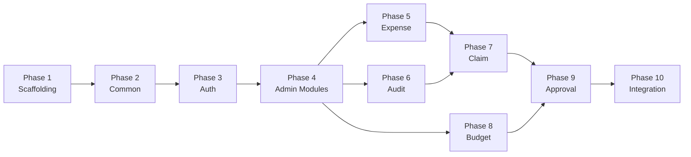

# Implementation Plan — Expense Reimbursement Management System

> **Reference:** [architecture-plan.md](file:///Users/naman.sukhwani/payoneer/documentation/architecture-plan.md)
> **Stack:** NestJS · PostgreSQL · TypeORM
> **Execution Order:** Bottom-up by dependency chain

---

## Approach

Build the MVP as a modular NestJS monolith, phase-by-phase following entity dependency order. Start with project scaffolding + shared kernel, then admin configuration modules (no upstream deps), then core domain modules (expense → claim → approval). Each phase is self-contained and testable before moving to the next.

## Scope

**In:**
- All 21 P0 features from architecture plan
- Database migrations for all 9 tables
- JWT authentication (no RBAC guards)
- Local filesystem receipt storage
- Audit trail (audit log + claim status history)
- API versioning (`/api/v1/`)

**Out:**
- RBAC guards / `@Roles()` decorator (P1)
- User CRUD module / controller (P1)
- Budget dashboard endpoint (P1)
- Notifications, cloud storage, reporting (P1)
- Frontend / UI
- Docker / CI/CD setup
- Unit tests (separate task — focus on integration-ready code)

---

## Phase 1: Project Scaffolding & Configuration

> Bootstrap NestJS project, configure TypeORM, set up shared infrastructure.

- [ ] **1.1** Scaffold NestJS project using `npx -y @nestjs/cli new ./` with strict TypeScript
- [ ] **1.2** Install core dependencies: `@nestjs/typeorm`, `typeorm`, `pg`, `@nestjs/config`, `@nestjs/jwt`, `@nestjs/passport`, `passport-jwt`, `bcrypt`, `class-validator`, `class-transformer`, `uuid`
- [ ] **1.3** Create `src/config/app.config.ts` — register env vars: `APP_PORT`, `APP_ENV`, `API_PREFIX`
- [ ] **1.4** Create `src/config/database.config.ts` — TypeORM connection config from env vars
- [ ] **1.5** Create `src/config/jwt.config.ts` — `JWT_SECRET`, `JWT_ACCESS_EXPIRY`, `JWT_REFRESH_EXPIRY`
- [ ] **1.6** Create `src/config/storage.config.ts` — `STORAGE_LOCAL_PATH`, `MAX_FILE_SIZE_MB`, `ALLOWED_FILE_TYPES`
- [ ] **1.7** Create `.env` and `.env.example` with all config keys from Appendix B
- [ ] **1.8** Configure `AppModule` with `ConfigModule.forRoot()` (global), `TypeOrmModule.forRootAsync()` using database config
- [ ] **1.9** Set global prefix `api/v1` and global validation pipe in `main.ts`

**✅ Validation:** App starts, connects to PostgreSQL, returns 404 on `GET /api/v1/health`

---

## Phase 2: Common / Shared Kernel

> Build reusable base classes, DTOs, filters, pipes, and decorators used across all modules.

- [ ] **2.1** Create `src/common/entities/base.entity.ts` — abstract class with `id` (UUID PK, auto-generated), `createdAt`, `updatedAt` (TypeORM `@CreateDateColumn`, `@UpdateDateColumn`)
- [ ] **2.2** Create `src/common/enums/claim-status.enum.ts` — `DRAFT | SUBMITTED | APPROVED | PARTIALLY_APPROVED | REJECTED | WITHDRAWN`
- [ ] **2.3** Create `src/common/enums/user-role.enum.ts` — `EMPLOYEE | MANAGER | ADMIN`
- [ ] **2.4** Create `src/common/dto/pagination-query.dto.ts` — `page`, `limit`, `sortBy`, `sortOrder`, with `class-validator` decorators, defaults (page=1, limit=20, max=100)
- [ ] **2.5** Create `src/common/interfaces/paginated-result.interface.ts` — generic `PaginatedResult<T>` with `data`, `meta` (page, limit, total, totalPages)
- [ ] **2.6** Create `src/common/filters/http-exception.filter.ts` — global exception filter returning `{ success, error: { code, message, details } }` envelope
- [ ] **2.7** Create `src/common/pipes/validation.pipe.ts` — global validation pipe with `whitelist: true`, `forbidNonWhitelisted: true`, `transform: true`
- [ ] **2.8** Create `src/common/decorators/current-user.decorator.ts` — `createParamDecorator` extracting user from request

**✅ Validation:** Import common module in AppModule. No runtime errors on startup.

---

## Phase 3: Authentication Module

> JWT login, token refresh, `/me` endpoint. User entity created here (DB table only, no CRUD controller).

- [ ] **3.1** Create `src/modules/auth/entities/user.entity.ts` — TypeORM entity matching USER schema (id, email, password_hash, first_name, last_name, role enum, department_id FK, reporting_manager_id FK, is_active). Extends `BaseEntity`
- [ ] **3.2** Create database migration for `user` table with all columns, indexes, and FK constraints
- [ ] **3.3** Create `src/modules/auth/dto/login.dto.ts` — `email` (IsEmail), `password` (IsString, MinLength)
- [ ] **3.4** Create `src/modules/auth/dto/auth-response.dto.ts` — `accessToken`, `refreshToken`, `user` (partial)
- [ ] **3.5** Create `src/modules/auth/strategies/jwt.strategy.ts` — Passport JWT strategy extracting payload `{ sub, email, role, departmentId, reportingManagerId }`
- [ ] **3.6** Create `src/common/guards/jwt-auth.guard.ts` — extends `AuthGuard('jwt')`
- [ ] **3.7** Create `src/modules/auth/auth.service.ts` — `login()`: validate credentials, issue access + refresh tokens. `refresh()`: validate refresh token, issue new pair. `getProfile()`: return user from JWT sub
- [ ] **3.8** Create `src/modules/auth/auth.controller.ts` — `POST /auth/login`, `POST /auth/refresh`, `GET /auth/me` (guarded)
- [ ] **3.9** Create `src/modules/auth/auth.module.ts` — register JwtModule, PassportModule, UserEntity, AuthService, JwtStrategy
- [ ] **3.10** Create `src/database/seeds/seed-admin.ts` — seed script to insert default admin user (bcrypt hashed password)

**✅ Validation:** `POST /api/v1/auth/login` returns JWT. `GET /api/v1/auth/me` with Bearer token returns user. Unauthenticated requests return 401.

---

## Phase 4: Admin Configuration Modules

> Department, Category, Currency (Exchange Rates), Settings — all Admin-managed, no upstream domain deps.

### 4A: Department Module

- [ ] **4A.1** Create `src/modules/department/entities/department.entity.ts` — matches DEPARTMENT schema. Extends `BaseEntity`
- [ ] **4A.2** Create migration for `department` table
- [ ] **4A.3** Create DTOs: `create-department.dto.ts` (name, allocated_budget, budget_currency), `update-department.dto.ts` (PartialType)
- [ ] **4A.4** Create `department.service.ts` — CRUD + `updateBudget()` method + paginated list
- [ ] **4A.5** Create `department.controller.ts` — `POST /departments`, `GET /departments`, `GET /departments/:id`, `PATCH /departments/:id`, `PATCH /departments/:id/budget`. All guarded with `JwtAuthGuard`
- [ ] **4A.6** Create `department.module.ts` — register entity, service, controller

### 4B: Category Module

- [ ] **4B.1** Create `src/modules/category/entities/category.entity.ts` — matches CATEGORY schema. Extends `BaseEntity`
- [ ] **4B.2** Create migration for `category` table
- [ ] **4B.3** Create DTOs: `create-category.dto.ts` (name, description, reimbursement_limit, limit_currency), `update-category.dto.ts`
- [ ] **4B.4** Create `category.service.ts` — CRUD + `findActiveCategories()` + `getCategoryLimit(categoryId)` + paginated list
- [ ] **4B.5** Create `category.controller.ts` — `POST /categories`, `GET /categories`, `PATCH /categories/:id`
- [ ] **4B.6** Create `category.module.ts`

### 4C: Currency Module

- [ ] **4C.1** Create `src/modules/currency/entities/exchange-rate.entity.ts` — matches EXCHANGE_RATE schema. Extends `BaseEntity`. Unique constraint on `(source_currency, target_currency)`
- [ ] **4C.2** Create migration for `exchange_rate` table with unique index
- [ ] **4C.3** Create `src/modules/currency/value-objects/money.vo.ts` — Money value object (amount, currency, `toBase(rate)`, `equals()`)
- [ ] **4C.4** Create DTOs: `create-exchange-rate.dto.ts` (source_currency, target_currency, rate, effective_from), `exchange-rate-response.dto.ts`
- [ ] **4C.5** Create `currency.service.ts` — CRUD + `convert(amount, sourceCurrency, targetCurrency): Money` + `getRate(source, target): number`
- [ ] **4C.6** Create `currency.controller.ts` — `POST /exchange-rates`, `GET /exchange-rates`, `DELETE /exchange-rates/:id`
- [ ] **4C.7** Create `currency.module.ts` — export `CurrencyService` for use by ExpenseModule

### 4D: Settings Module

- [ ] **4D.1** Create `src/modules/settings/entities/system-setting.entity.ts` — matches SYSTEM_SETTING schema
- [ ] **4D.2** Create migration for `system_setting` table. Seed `BASE_CURRENCY = USD`
- [ ] **4D.3** Create `settings.service.ts` — `get(key)`, `set(key, value)`, `getAll()`, `getBaseCurrency(): string`
- [ ] **4D.4** Create `settings.controller.ts` — `GET /settings`, `PATCH /settings/:key`
- [ ] **4D.5** Create `settings.module.ts` — export `SettingsService` globally

**✅ Validation (Phase 4):** All CRUD endpoints work. Categories have limits. Exchange rates have unique pairs. Settings returns base currency. All paginated.

---

## Phase 5: Expense Module (Core)

> Employee creates/edits/deletes expenses, uploads receipts. Policy validation flags violations.

- [ ] **5.1** Create `src/modules/expense/entities/expense.entity.ts` — matches EXPENSE schema. Relations: `@ManyToOne(() => User)`, `@ManyToOne(() => Category)`, `@ManyToOne(() => ReimbursementClaim, { nullable: true })`. Extends `BaseEntity`
- [ ] **5.2** Create migration for `expense` table with all indexes (user_id, claim_id, category_id, reimbursable partial index)
- [ ] **5.3** Create DTOs: `create-expense.dto.ts` (title, categoryId, amount, currency, expenseDate, notes, isReimbursable), `update-expense.dto.ts`, `expense-response.dto.ts` (includes convertedAmount, baseCurrency, hasPolicyViolation, policyViolationReason)
- [ ] **5.4** Create `src/modules/expense/local-storage.service.ts` — `upload(file, subPath): string`, `download(filePath): Buffer`, `delete(filePath): void`. Uses `fs/promises`. Creates upload dir if not exists. Path: `{STORAGE_LOCAL_PATH}/{userId}/{uuid}-{originalName}`
- [ ] **5.5** Create `src/modules/expense/policy-validator.service.ts` — inject `CategoryService`. Method: `validate(expense): { hasViolation: boolean, reason: string | null }`. Compares expense amount (converted to limit currency) against category limit. **Flags but does NOT block**
- [ ] **5.6** Create `expense.service.ts`:
  - `create()`: validate category exists, convert to base currency via `CurrencyService`, run policy validation, save
  - `update()`: only if expense not attached to a submitted/approved claim
  - `delete()`: only if expense not attached to a submitted/approved claim, also delete receipt file
  - `findAllByUser()`: paginated, filterable by category, reimbursable status, date range
  - `findById()`: with ownership check
  - `uploadReceipt()`: validate file type/size, call `LocalStorageService.upload()`, update entity
  - `downloadReceipt()`: return buffer from `LocalStorageService.download()`
  - `deleteReceipt()`: remove file, clear entity fields
  - `findUnattachedReimbursable(userId)`: expenses where `isReimbursable=true` AND `claimId IS NULL`
- [ ] **5.7** Create `expense.controller.ts`:
  - `POST /expenses` — create
  - `GET /expenses` — list (paginated)
  - `GET /expenses/:id` — detail
  - `PATCH /expenses/:id` — update
  - `DELETE /expenses/:id` — delete
  - `POST /expenses/:id/receipt` — upload (multipart, `@UseInterceptors(FileInterceptor('receipt'))`)
  - `GET /expenses/:id/receipt` — download (stream response)
  - `DELETE /expenses/:id/receipt` — remove
- [ ] **5.8** Create `expense.module.ts` — import `CategoryModule`, `CurrencyModule`, `SettingsModule`. Register entity, services, controller

**✅ Validation:** Create expense → auto-converts to base currency. Policy violation flagged (not blocked). Receipt upload/download works. Cannot edit expense attached to submitted claim.

---

## Phase 6: Audit Module

> Audit log + claim status history. Built before Claim module since Claim and Approval both depend on it.

- [ ] **6.1** Create `src/modules/audit/entities/audit-log.entity.ts` — matches AUDIT_LOG schema. `old_values` and `new_values` as `jsonb` columns
- [ ] **6.2** Create `src/modules/audit/entities/claim-status-history.entity.ts` — matches CLAIM_STATUS_HISTORY schema. Relations to claim, user
- [ ] **6.3** Create migrations for `audit_log` and `claim_status_history` tables with indexes
- [ ] **6.4** Create `audit.service.ts`:
  - `logAction(entityType, entityId, action, actorId, oldValues?, newValues?, ipAddress?)`: insert audit log
  - `logStatusChange(claimId, fromStatus, toStatus, changedById, reason?)`: insert claim status history
  - `findAuditLogs(filters)`: paginated, filterable by entity_type, entity_id, actor_id, date range
  - `findClaimHistory(claimId)`: ordered by changed_at ASC
- [ ] **6.5** Create `src/common/interceptors/audit.interceptor.ts` — NestJS interceptor. Captures entity type (from `@Auditable()` decorator), compares pre/post state for updates, calls `AuditService.logAction()`. Extracts actor from request user, IP from request
- [ ] **6.6** Create `src/common/decorators/auditable.decorator.ts` — `@Auditable('EXPENSE')` sets metadata for audit interceptor
- [ ] **6.7** Create `audit.controller.ts` — `GET /audit-logs` (paginated, filterable), `GET /claims/:id/history`
- [ ] **6.8** Create `audit.module.ts` — export `AuditService` globally for use by Claim, Approval modules

**✅ Validation:** Manual call to `AuditService.logAction()` persists audit record. `GET /audit-logs` returns paginated results.

---

## Phase 7: Claim Module (Core)

> Create, edit, submit, withdraw reimbursement claims. State machine enforces transitions.

- [ ] **7.1** Create `src/modules/claim/entities/reimbursement-claim.entity.ts` — matches REIMBURSEMENT_CLAIM schema. Relations: `@ManyToOne(() => User)` (employee), `@ManyToOne(() => Department)`, `@OneToMany(() => Expense)`, `@OneToMany(() => ApprovalAction)`, `@OneToMany(() => ClaimStatusHistory)`. Extends `BaseEntity`
- [ ] **7.2** Create migration for `reimbursement_claim` table with indexes. Create DB sequence for claim_number: `CLM-{YYYY}-{seq:5}`
- [ ] **7.3** Create DTOs: `create-claim.dto.ts` (expenseIds: UUID[], employeeNotes?), `update-claim.dto.ts` (addExpenseIds?, removeExpenseIds?, employeeNotes?), `claim-response.dto.ts` (includes expenses[], statusHistory[], approvalActions[])
- [ ] **7.4** Create `src/modules/claim/claim-state-machine.service.ts`:
  - Define valid transitions map: `{ DRAFT: [SUBMITTED], SUBMITTED: [APPROVED, PARTIALLY_APPROVED, REJECTED, WITHDRAWN] }`
  - `canTransition(from, to): boolean`
  - `validateTransition(from, to): void` — throws `CLAIM_INVALID_STATE_TRANSITION` if invalid
  - `getAvailableTransitions(status): ClaimStatus[]`
- [ ] **7.5** Create `claim.service.ts`:
  - `create(userId, dto)`: generate claim_number, validate all expenseIds belong to user and are reimbursable and unattached, calculate total_amount (sum of converted amounts), set status=DRAFT, attach expenses (set expense.claimId)
  - `update(claimId, userId, dto)`: only if DRAFT. Add/remove expenses, recalculate total
  - `submit(claimId, userId)`: validate DRAFT→SUBMITTED via state machine, validate ≥1 expense, set submitted_at. Log status change via AuditService
  - `withdraw(claimId, userId)`: validate SUBMITTED→WITHDRAWN via state machine, validate ownership. Detach expenses (set claimId=null). Log status change
  - `findById(claimId, userId)`: with expenses, history, approval actions
  - `findAllByUser(userId, filters)`: paginated, filterable by status
  - `findPendingForManager(managerId)`: find claims where employee.reporting_manager_id = managerId AND status = SUBMITTED
- [ ] **7.6** Create `claim.controller.ts`:
  - `POST /claims` — create draft
  - `GET /claims` — list my claims
  - `GET /claims/:id` — detail with expenses + history
  - `PATCH /claims/:id` — update draft
  - `POST /claims/:id/submit` — submit
  - `POST /claims/:id/withdraw` — withdraw
- [ ] **7.7** Create `claim.module.ts` — import `ExpenseModule` (forwardRef if circular), `AuditModule`. Export `ClaimService` for ApprovalModule

**✅ Validation:** Create claim with expenses → DRAFT. Submit → SUBMITTED (logged in status history). Withdraw → WITHDRAWN (expenses detached). Invalid transition → 400 error. Cannot submit with 0 expenses.

---

## Phase 8: Budget Module (Internal Service)

> Internal service consumed by ApprovalModule. No controller for MVP.

- [ ] **8.1** Create `src/modules/budget/budget.service.ts`:
  - `consumeBudget(departmentId, amount, currency)`: atomically increment consumed budget on department. Uses TypeORM query builder with `UPDATE ... SET consumed_budget = consumed_budget + :amount`. Validates consumed ≤ allocated (throws `INSUFFICIENT_DEPARTMENT_BUDGET` if exceeded)
  - `releaseBudget(departmentId, amount)`: reverse consumption (for future use — claim reversal)
  - `getBudgetSummary(departmentId)`: returns `{ allocated, consumed, remaining, currency }`
- [ ] **8.2** Add `consumed_budget` column (decimal, default 0) to department entity and migration
- [ ] **8.3** Create `budget.module.ts` — import `DepartmentModule`, export `BudgetService`

**✅ Validation:** `consumeBudget()` updates department record. Exceeding allocation throws error. `getBudgetSummary()` returns correct remaining.

---

## Phase 9: Approval Module (Core)

> Manager approves/rejects claims. Transactionally updates claim status + budget.

- [ ] **9.1** Create `src/modules/approval/entities/approval-action.entity.ts` — matches APPROVAL_ACTION schema. Relations: `@ManyToOne(() => ReimbursementClaim)`, `@ManyToOne(() => User)` (manager). Extends `BaseEntity`
- [ ] **9.2** Create migration for `approval_action` table with indexes
- [ ] **9.3** Create DTOs:
  - `approve-claim.dto.ts` (comment?: string)
  - `partial-approve-claim.dto.ts` (approvedAmount: number — required, IsPositive; comment: string — required, MinLength(10))
  - `reject-claim.dto.ts` (comment: string — required, MinLength(10))
- [ ] **9.4** Create `approval.service.ts`:
  - **All approval actions wrapped in TypeORM transaction** (`queryRunner.startTransaction()`)
  - `approve(claimId, managerId, dto)`:
    1. Load claim with employee relation
    2. Validate claim status = SUBMITTED (via state machine)
    3. Validate managerId = claim.employee.reportingManagerId
    4. Update claim: status=APPROVED, approved_amount=total_amount, resolved_at=now
    5. Call `BudgetService.consumeBudget(claim.departmentId, approved_amount)`
    6. Insert `ApprovalAction` (action=APPROVED, approval_level=1)
    7. Log status change via `AuditService.logStatusChange()`
    8. Log audit via `AuditService.logAction()`
    9. Commit transaction
  - `partialApprove(claimId, managerId, dto)`:
    1. Same as approve but: validate `dto.approvedAmount < claim.totalAmount`
    2. status=PARTIALLY_APPROVED, approved_amount=dto.approvedAmount
    3. Comment is mandatory (validated in DTO)
    4. Budget consumed = dto.approvedAmount
  - `reject(claimId, managerId, dto)`:
    1. Same validation flow
    2. status=REJECTED, no budget consumption
    3. Comment mandatory
  - `findPendingForManager(managerId)`: claims where employee's reporting manager = managerId AND status = SUBMITTED. Paginated
  - `findApprovalHistory(managerId)`: past actions by this manager. Paginated
- [ ] **9.5** Create `approval.controller.ts`:
  - `GET /approvals/pending` — list pending claims for current manager
  - `GET /approvals/history` — list past approval actions
  - `GET /approvals/claims/:id` — view claim detail for review
  - `POST /approvals/claims/:id/approve` — approve
  - `POST /approvals/claims/:id/partial-approve` — partial approve
  - `POST /approvals/claims/:id/reject` — reject
- [ ] **9.6** Create `approval.module.ts` — import `ClaimModule`, `BudgetModule`, `AuditModule`

**✅ Validation:** Approve claim → status=APPROVED, budget consumed. Partial approve → PARTIALLY_APPROVED, partial budget consumed, comment saved. Reject → REJECTED, no budget consumed, comment saved. Non-manager → 403. Non-SUBMITTED claim → 400. All actions logged in audit + status history.

---

## Phase 10: Integration & Polish

> Wire everything together, add audit interceptor globally, seed data, final validation.

- [x] **10.1** Apply `@Auditable()` decorator to all controller methods that create/update/delete entities (expense, claim, department, category, exchange-rate, settings)
- [x] **10.2** Register `AuditInterceptor` globally in `AppModule` (or per-controller)
- [x] **10.3** Register `HttpExceptionFilter` globally in `main.ts`
- [x] **10.4** Create `src/database/seeds/seed-data.ts` — seed script:
  - 2 departments (Engineering, Marketing) with budgets
  - 5 categories (Travel, Meals, Office Supplies, Software, Equipment) with limits
  - 3 users (1 admin, 1 manager, 1 employee) with proper relationships
  - Exchange rates (USD→EUR, USD→INR, EUR→INR)
  - System setting: BASE_CURRENCY=USD
- [x] **10.5** Add `consumed_budget` field to department response DTOs
- [x] **10.6** Verify all endpoints return standard response envelope (`{ success, data, meta }`)
- [x] **10.7** Run full happy-path flow manually:
  1. Login as employee
  2. Create expense (multi-currency) → verify conversion + policy flag
  3. Upload receipt
  4. Create claim with expenses
  5. Submit claim
  6. Login as manager
  7. View pending claims
  8. Approve claim → verify budget consumed
  9. Verify audit log + status history
- [x] **10.8** Verify error paths: invalid state transitions, unauthorized approval, missing comment on reject, duplicate exchange rate pair

**✅ Validation:** Complete end-to-end flow works. All P0 features operational. Error responses follow envelope format. Audit trail complete.

---

## Execution Order Summary

## Open Questions

1. **Claim number format** — `CLM-{YYYY}-{00042}` acceptable? Or prefer different format?
2. **Seed data** — should seed script be runnable via npm command (e.g., `npm run seed`)? Or TypeORM seeder pattern?
3. **File size limit** — 10MB max per receipt confirmed? Any specific image resolution constraints?
